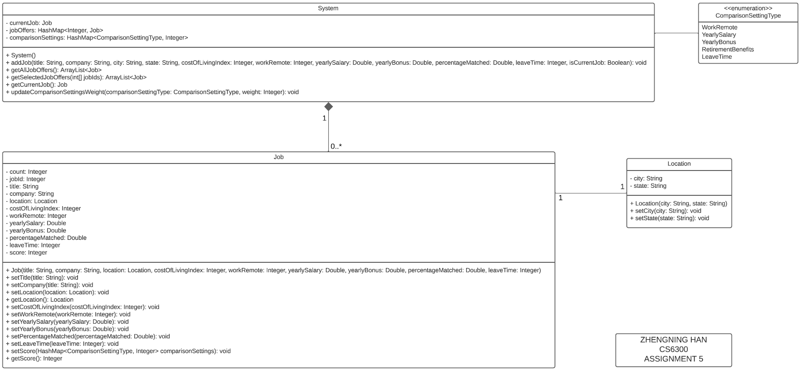
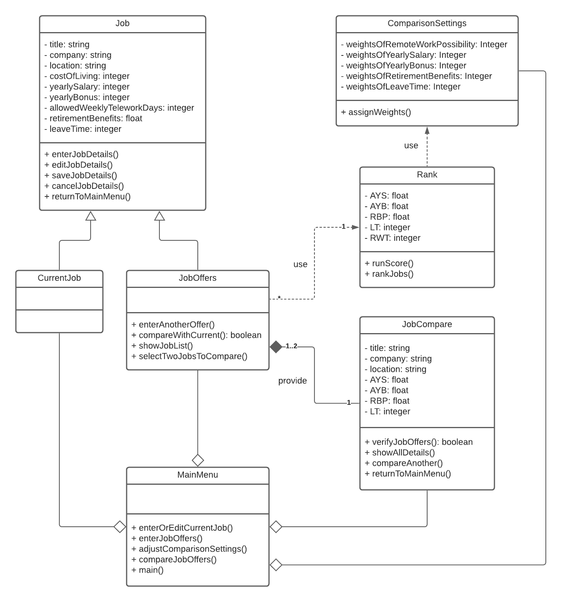
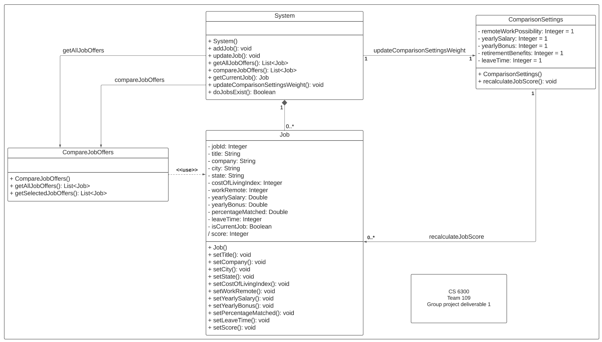

CS 6300 
Team 109 Deliverable 1

# Design 1
by Zhengning Han

### Pros
1. Low number of classes so pretty lightweight and easy to implement.
1. Includes details and allows users to easily update an attribute within a Job instance using the corresponding set method.

### Cons
1. Not necessary to have a separate Location class because there's no real value add. Same city and state in current design will result in 2 separate instances.
1. Job class operation setScore uses comparisonSettings so should have link to ComparisonSettingType.

# Design 2
by Teng Xue

### Pros
1. Shows clear relationship between the classes.
1. If need to modify Job class in the future, both CurrentJob and JobOffers will get the change since they are child classes of Job.

### Cons
1. JobCompare should connect to CurrentJob because user can compare current job with job offers
1. Can decouple frontend and backend classes e.g MainMenu is UI class whereas JobCompare is a backend class so would be nice if JobCompare does not returnToMainMenu

# Design 3
by Yi Wang

### Pros
1. Going above and beyond the requirement and thinking about how the user might need to login and creating a User class to handle that.

### Cons
1. Current Job and Job Offers should have the attribute in Jobs if the relationship is one of composition.
1. UI movements e.g. save, exit operations in Job Offers, that should be decoupled.

# Design 4
by Edmond Truong

### Pros
1. Clear logic and flow of things with methods included on the relationship lines.
1. Performance advantage to calculate score when ComparisonSettings is updated rather than waiting for score to be calculated only when the user chooses to compare job offers.

### Cons
1. Instead of using directed association relationship between App and the other classes, can represent using aggregation relationship.

# Team Design

### Commonalities
1. Many of the classes, e.g. System, Job, are common to all of our individual designs.
1. We agreed on the existence of relationships between the classes.
1. The attributes and operations of each class are similar to our individual designs.

### Differences
1. We differed in how we represent currentJob e.g. using a boolean isCurrentJob in the Job class vs. having a child class CurrentJob. We decided to go with a boolean because current job and job offers do not differ in attributes so we didn't think it was necessary to have a child class specifically to represent these at this point. 
1. We differed in the type of relationship between the classes e.g. composition vs. aggregation between System and Job class. We also added more details on the relationship lines to indicate the name of the relationship e.g. compareJobOffers, getAllJobOffers. Since System is the entry class which is responsible for creating instances of Jobs, we felt that System consists of Jobs, so it's a composition relationship. We also added details to the relationship lines to make things easier to read.
1. We decoupled the frontend aspects of the design from our UML diagram. This is to keep the frontend and the backend independent so the backend will not drive the frontend implementation or vice versa.

# Summary
1. When there are multiple options available, we should consider whether the difference is simply due to design choice or if it will have important implications downstream during implementation.
1. Gained a better understanding of how to represent relationships between classes after discussing with the team.
1. It was easier to meet and discuss this live over video call vs. trying to discuss and complete the assignment asynchronously.
1. Not expecting to know all the answers coming into team discussions, learning along the way and being flexible about changes.