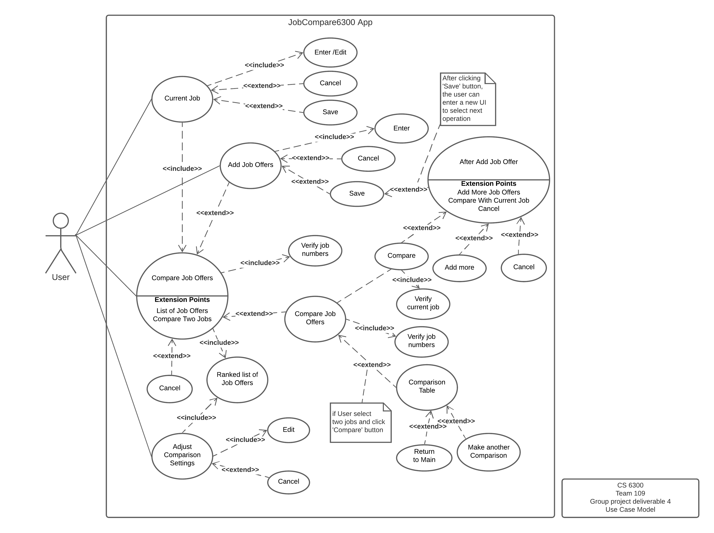

# Use Case Model

**Author**: Team 109

## 1 Use Case Diagram v3

v1 to v2: Design of use case model changed
v2 to v3: Renamed to JobCompare6300 App

## 2 Use Case Descriptions

1. Current Job
- *Requirements: User can 'enter/edit current job', 'save current job details and then return to the main menu', and 'cancel without saving and then return to the main menu'.*
- *Pre-conditions: Click the 'Enter/Edit Current Job' button then enter the Current Job GUI.*  
- *Post-conditions The user can either click the 'Save' button or 'Cancel' button to return the main menu.*
- *Scenarios:* 
    1. *Once the user enters the Current Job GUI, the interface will load and show all the existing information of the user's current job.* 
    1. *If there is no information, the user is able to enter a new current job. The user has to enter all of the required job details before saving it.* 
    1. *If the user wants to modify some current job information, the user can directly edit it.* 
    1. *If the user wants to save the current information, the user can click the 'Save' button, and then return to the main menu.*
    1. *If the user did not provide all of the required information, the user can't save the current job and return.*
    1. *If the user wants to cancel current editing without saving, the user can click the 'Cancel' button to return the main menu without saving.* 
   
2. Add Job Offers
- *Requirements: User can 'enter job offers', 'save job offer details', 'cancel and return to the main menu', 'add more job offers' and 'compare current job offer with current job (if present)'*
- *Pre-conditions: Click the 'Enter Job Offers' button then enter the Job Offer GUI. After saving the job offer, if the user wants to compare the job offer with current job, the user must have saved a current job before.*
- *Post-conditions: The user can either click the 'Save' button to enter next interface for further operation, including 'add more job offers' and 'compare current job offer with current job (if present)'or click 'Cancel' button to return the main menu.*
- *Scenarios:*
     1. *Once the user enters the Enter Job Offers GUI, the interface will show an empty form to allow user to enter all of details of a job offer.* 
     1. *If the user wants to save the offer information, the user can click the 'Save' button to enter next interface for next operation.*
     1. *If the user did not provide all of the required infomation, the user can't save the job offer.*
     1. *If the user wants to cancel current editing without saving, the user can click the 'Cancel' button to return the main menu.* 
     1. *Once the user saved the job offer details successfully, a new interface will pop up, asking the user what he/she wants to do next. The user can select to return to the main menu, add another offer, or compare current offer with current job (if present, the app will check the current job)* 
     1. *If the user selects 'Enter Another Job Offer' button, the interface will show a new empty form to allow the user to enter all of the details of a new job offer as step 1*
     1. *If the user selects 'Compare With Current Job' button, a comparison between the current job offer and the current job will be shown in a table.*
     1. *In the Job Comparison GUI, the user is able to return to the main menu by clicking the 'Return to Main Menu' button in the Compare Job interface, or compare another job offers by clicking 'Make Another Comparison' button.* 
     

3. Compare Job Offers 
- *Requirements: User can see 'a ranked list of job offers including current job (if present)', 'compare two offers', and 'return to main menu'.*
- *Pre-conditions: There are at least 2 jobs in the system. Click the 'Compare Job Offers' button and then enter the Ranked List of Jobs GUI.*
- *Post-conditions: The user must click the 'Cancel' button to return the main menu, or click 'Compare' button to compare selected two job offers.*
- *Scenarios:*
    1. If there are not at least two job offers in the database, the user can't click the 'Compare job offers' button from main menu.
    1. *Once the user enters the compare job GUI, the interface will show a ranked list of job offers, including current job. The current job will be indicated in the list.* 
    1. *The user is able to return to the main menu by clicking the 'Cancel' button.* 
    1. *If the user wants to compare two job offers, the user can select two listed job offers and click the 'Compare' button. A table comparing the two selected jobs will be shown in a new interface.* 
    1. *In the Job Comparison GUI, The user can either return to the main menu by clicking the 'Return to Main Menu' button, or compare other job offers by clicking 'Make Another Comparison' button.*

4. Adjust Comparison Settings
- *Requirements: User can assign integer weights to corresponding factors*
- *Pre-conditions: Click the 'Adjust Comparison Settings' button then enter the Comparison Settings GUI.*
- *Post-conditions: The user must click the 'Cancel' button to return the main menu. No empty weights are allowed. The user cannot enter all 0s.*
- *Scenarios:*
     1. *If the user did not set any weights, all default weights are one.* 
     1. *If the user enters the Adjust Comparison Settings GUI, the saved weight values will be loaded and shown.*
     1. *The user can modify the weights by entering integer numbers for the corresponding factors.* 
     1. *The user can save the settings and return the main menu by clicking the 'Save' button.*
     1. *The user also can return to the main menu without saving by clicking the 'Cancel' button.* 